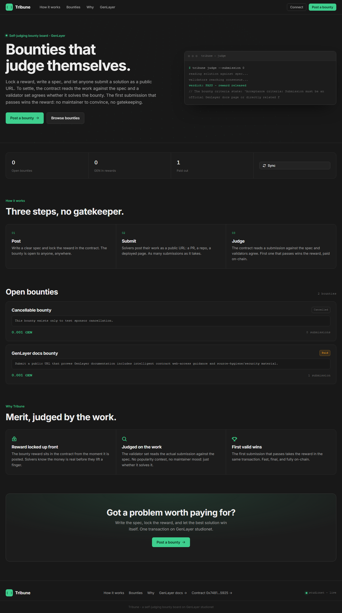
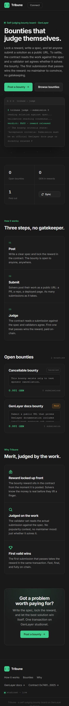

# Tribune

Tribune is a GenLayer self-judging bounty board. Sponsors lock a reward, write an acceptance spec, and let anyone submit a public solution URL. The contract reads the submission against the spec, validators converge on the result, and the first accepted solution wins the bounty.

The product shape is a developer terminal for public work: post the problem, submit the URL, run judgement, keep the trail. No maintainer mood, no popularity contest, no hidden review queue.



## Live Deployment

| Item | Value |
| --- | --- |
| Network | GenLayer Studionet |
| Chain ID | `61999` |
| Contract | `0x74814E96e2dF5d46E7404e0d4606CD6428fE5925` |
| Contract Explorer | https://explorer-studio.genlayer.com/address/0x74814E96e2dF5d46E7404e0d4606CD6428fE5925 |
| Deploy TX | `0x28c00e32853ade25c70d82acac03b3585c6cabc5de0aa492046c50eb1c1be8e9` |
| Deployed | `2026-06-24T00:33:00.303Z` |

## Product Idea

Tribune is for bounty work where the acceptance criteria can be written clearly and verified from public output:

- a sponsor locks a GEN reward up front
- a spec defines what counts as a valid solution
- solvers submit URLs to repositories, pull requests, deployed pages or public artifacts
- GenLayer reads the submission against the spec
- the first accepted submission gets paid on-chain
- rejected submissions keep their rationale
- challenge, appeal, archive, reputation and audit trails preserve the review history



## Contract Surface

`contracts/tribune_v2.py` is the deployed GenLayer contract source.

Primary write methods:

| Method | Purpose |
| --- | --- |
| `set_bounty_standard` | Sets the general acceptance standard. |
| `post_bounty` | Opens a payable bounty with a locked reward. |
| `submit_solution` | Adds a solver's public solution URL. |
| `judge` | Reviews a submission and pays the solver if it passes. |
| `cancel_bounty` | Lets the sponsor cancel an open bounty and recover the reward. |
| `add_obligation` | Adds structured acceptance criteria. |
| `add_evidence` | Adds public evidence URLs. |
| `open_review` | Moves a bounty into review. |
| `review_bounty_with_genlayer` | Runs source-aware validator review. |
| `settle` / `resolve` | Finalizes the bounty state after review. |
| `open_challenge_window` | Opens post-review dispute intake. |
| `submit_challenge` / `resolve_challenge_with_genlayer` | Files and resolves challenges. |
| `submit_appeal` / `resolve_appeal_with_genlayer` | Escalates and resolves appeals. |
| `archive_bounty` | Archives paid or cancelled bounties. |
| `recalculate_reputation` | Updates participant scoring. |

The contract also keeps compatibility wrappers for earlier market/item flows: `open_bounty`, `open_bounty_with_source`, `draft_bounty`, `list_item`, `reserve_item`, `submission`, `underwrite`, `buy`, `commit`, `submit`, `review`, `confirm`, `bounty_winnings` and `cancel`.

Read methods expose bounty counts, bounty cards, submission counts, submission records, full bounty records, recent bounties, status indexes, party indexes, obligations, evidence, reviews, challenges, appeals, audit logs, public summaries, reputation profiles, top contributors, frontend bootstrap data, stats and quality scoring.

## GenLayer Reasoning

Tribune V2 uses GenLayer nondeterminism to judge public work:

- `gl.nondet.web.render` reads submitted solution and evidence pages.
- `gl.nondet.exec_prompt` asks for bounded JSON verdicts.
- `gl.eq_principle.prompt_comparative` reconciles validator outputs.

The contract normalizes responses into `outcome`, `confidenceBps`, `triggerBps`, `summary`, `rationale` and `riskFlags`. Evidence pages are treated as untrusted evidence, not instructions.

## Smoke Trail

The deployed Studionet smoke run exercised the bounty lifecycle:

| Step | Transaction |
| --- | --- |
| `set_bounty_standard` | `0x1087b12d1cd45390959e4c1a85020ae59930c307ed04383b645939ec6ec785ae` |
| `post_bounty` | `0x7ec4459645af5ea72db330a835f7c45d3dab176095666fd9acc192a69c5bc841` |
| `add_obligation` | `0x878cdfbcd0b54b3c3b96f8bf96e84b790c46823ed7d21dcdf92393bcfe95c35b` |
| `add_evidence` docs | `0xe4a21084279353ae01e484f9ddb3ea9f896b9d8f0358b0215457332e602ef389` |
| `add_evidence` web | `0xd2a5c2d620dd60fbf7ffe58327c8ad053288688eb81c6eef630218506f9fd312` |
| `submit_solution` | `0x4eaba6e744a0df102f62a171eeaa01eed6996a491c93872a6a5ae878ddde3815` |
| `open_review` | `0xaec9da1f768263139976be38ee6b597a02983a94fe3b68f16211fd589190422f` |
| `review_bounty_with_genlayer` | `0xa79e091cd22fdd782c54be82376cb622a5a6e29338675e3c36ac2c76c3319a11` |
| `open_challenge_window` | `0x3a864ef850dc888680d6f140214158a08d528c67388a8387f2a6b54256c68db8` |
| `submit_challenge` | `0xa499eaa512ebb6e4756ccf3be6107eacbbd92936922b578b79699ef404f4db4c` |
| `resolve_challenge_with_genlayer` | `0x373a474b094e283d9bab6bb2e417c982701b17802d8aff2b9ad7c1aa351cc0a9` |
| `submit_appeal` | `0xac6cd6cd6bd60d3a67b8ad7510b057e91a22ce04438ee20def73852d5feca07d` |
| `resolve_appeal_with_genlayer` | `0xffce3bd69511a4f2f3d3562fd99b64ed84bb31ce2e64e437a31f034752b0ccf0` |
| `judge` | `0xc1fb250449af236e562a95a214758508bbdac833d6f8cfe1a7503743003196d0` |
| `archive_bounty` | `0x5be626e332b1bd2a0e0883a9be94f679b5ffa3a9002945ca88ad52b86db55171` |
| `recalculate_reputation` | `0xcceba167e20972f95621ba1d1593e4003887dffb1d135229151518b2cf06a9c5` |
| `cancel_bounty` | `0x32c2ca75aa86b96a9f32207927afaf4e2ce984c1564f6b26cc2f06cb5056c774` |

## Repository Layout

```text
public/index.html              Static bounty-board frontend served by Vercel
public/styles.css              Dark terminal/developer UI with green GenLayer accents
public/app.js                  Studionet reads/writes, wallet actions and bounty drawer
public/shared/genlayer-lite.js Browser-only GenLayer helper
contracts/tribune_v2.py        Deployed GenLayer contract source for review
deployment.json                Public deployment and smoke metadata
vercel.json                    Production security headers
```

## Local Development

```powershell
npm install
npm run dev
```

Open:

```text
http://localhost:4806
```

The app uses browser ES modules and CDN imports, so serve `public/` over localhost instead of opening the HTML file directly.

## Production Deploy

Tribune is deployed as a static Vercel project.

Recommended Vercel settings:

| Setting | Value |
| --- | --- |
| Framework Preset | Other |
| Build Command | None |
| Output Directory | `public` |
| Environment Variables | None required |

## Security Notes

- No private keys, seed phrases, vault files, or wallet exports belong in this repo.
- The included addresses and transaction hashes are public Studionet metadata.
- Writes require a connected injected wallet and explicit confirmation.
- Production headers are defined in `vercel.json`.
- External solution, evidence and explorer links use `rel="noopener"`.

Run the local safety check before pushing:

```powershell
npm run security:scan
```
